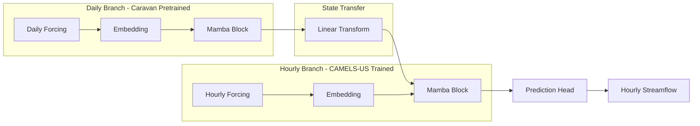
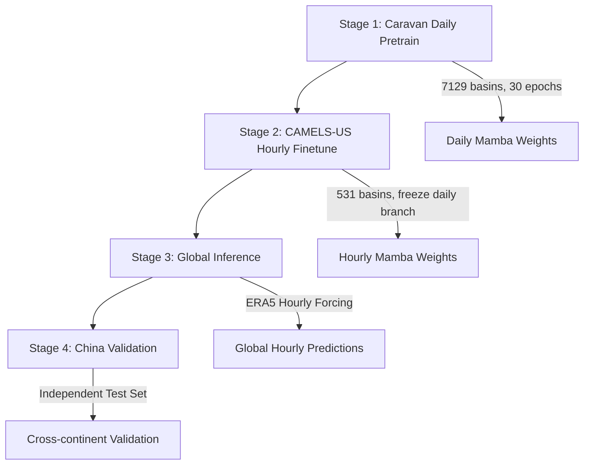

# 全球水文迁移学习论文计划 (Mamba + Global Transfer)

## 一、项目现状诊断

### 已完成

- Mamba 模型实现 (~95%)，位于 [neuralhydrology/modelzoo/mamba.py](neuralhydrology/modelzoo/mamba.py)
- Caravan 训练配置，位于 [hpc/caravan_hpc.yml](hpc/caravan_hpc.yml)
- HPC 部署脚本，位于 [hpc/](hpc/) 目录
- Caravan 训练 Job 154574 已启动（状态待确认）

### 待解决的关键问题

1. **Mamba 不支持多时间尺度 (MTS)**：当前 Mamba 被标记为 `SINGLE_FREQ_MODELS`，无法处理日+小时混合数据
2. **中国小时数据缺失**：需要获取作为独立测试集
3. **Caravan 训练状态未知**：需要登录 HPC 确认

---

## 二、技术架构

### 目标架构：MTS-Mamba (Multi-Timescale Mamba)



### 迁移学习流程



---

## 三、论文创新点

1. **架构创新**：首个 MTS-Mamba (多时间尺度状态空间模型) 用于水文建模
2. **应用创新**：首个全球尺度的跨时间分辨率迁移学习
3. **验证创新**：跨大陆泛化验证（美国训练 → 中国测试）

---

## 四、详细执行步骤

### Phase 1: 基础设施完善 (Week 1-2)

**1.1 确认 HPC 训练状态**

- 登录 HPC 检查 Job 154574 状态
- 如训练完成，下载模型权重到本地
- 如训练失败，分析原因并重新提交

**1.2 修复已知问题**

- 修复 Mamba 的 Windows tqdm 问题 ([neuralhydrology/modelzoo/mamba.py](neuralhydrology/modelzoo/mamba.py))
- 安装 mamba-ssm CUDA kernel 加速训练（参考 [hpc/install_mamba_ssm.sh](hpc/install_mamba_ssm.sh)）

### Phase 2: MTS-Mamba 架构开发 (Week 3-6)

**2.1 设计 MTS-Mamba 架构**

- 参考 MTS-LSTM 实现 ([neuralhydrology/modelzoo/mtslstm.py](neuralhydrology/modelzoo/mtslstm.py))
- 创建新文件 `neuralhydrology/modelzoo/mtsmamba.py`
- 关键修改：
  - 用 Mamba Block 替换 LSTM
  - 适配 Mamba 的状态表示（与 LSTM 的 h/c 不同）
  - 保持 transfer_fcs 层用于跨频率状态传递

**2.2 代码实现要点**

```python
# mtsmamba.py 核心结构
class MTSMamba(BaseModel):
    module_parts = ['embedding_net', 'mambas', 'transfer_fcs', 'heads']
    
    def __init__(self, cfg):
        # 每个频率一个 Mamba Block
        self.mambas = nn.ModuleDict()
        for freq in cfg.use_frequencies:
            self.mambas[freq] = MambaBlock(...)
        
        # 状态传递层
        self.transfer_fcs = nn.ModuleDict()
```

**2.3 注册与配置**

- 在 [neuralhydrology/modelzoo/__init__.py](neuralhydrology/modelzoo/__init__.py) 注册新模型
- 创建 MTS-Mamba 配置文件

### Phase 3: 实验设计与执行 (Week 7-14)

**3.1 基准实验 (Benchmark)**

| 实验 | 模型 | 数据 | 目的 |

|------|------|------|------|

| Exp-1 | LSTM | CAMELS-US Daily | Baseline |

| Exp-2 | Mamba | CAMELS-US Daily | SSM vs RNN |

| Exp-3 | MTS-LSTM | CAMELS-US Daily+Hourly | 多时间尺度 Baseline |

| Exp-4 | MTS-Mamba | CAMELS-US Daily+Hourly | 核心方法 |

**3.2 迁移学习实验**

| 实验 | 预训练 | 微调 | 测试 |

|------|--------|------|------|

| Transfer-1 | Caravan Daily (LSTM) | CAMELS-US Hourly | CAMELS-US |

| Transfer-2 | Caravan Daily (Mamba) | CAMELS-US Hourly | CAMELS-US |

| Transfer-3 | Caravan Daily (MTS-Mamba) | CAMELS-US Hourly | CAMELS-US + China |

**3.3 全球泛化实验**

- 使用 ERA5 Hourly 作为全球驱动数据
- 在 CAMELS-GB (英国) 和 CAMELS-AUS (澳洲) 上验证

### Phase 4: 中国数据获取与验证 (Week 12-18)

**4.1 数据来源选择**

| 来源 | 优点 | 缺点 |

|------|------|------|

| 水科院/水利部 | 官方高质量 | 获取困难 |

| GRDC | 全球公开 | 时间分辨率多为日 |

| 导师渠道 | 可能更快 | 依赖关系 |

**4.2 数据处理**

- 将中国数据格式化为 NeuralHydrology 兼容格式
- 提取相应流域的 ERA5 Hourly 驱动数据

**4.3 验证实验**

- Zero-shot: 直接用美国训练的模型预测中国
- Few-shot: 用少量中国数据微调

### Phase 5: 论文撰写 (Week 16-24)

**5.1 论文结构**

- Introduction: 全球小时预报的挑战，SSM 的优势
- Methods: MTS-Mamba 架构，迁移学习策略
- Experiments: 基准对比，迁移实验，跨大陆验证
- Discussion: 物理可解释性，局限性

**5.2 目标期刊**

- 首选: Water Resources Research (WRR) / Hydrology and Earth System Sciences (HESS)
- 备选: Journal of Hydrology

---

## 五、风险与应对

| 风险 | 概率 | 应对方案 |

|------|------|----------|

| MTS-Mamba 开发困难 | 中 | 先用 Mamba + Fine-tune 作为 Plan B |

| 中国数据获取失败 | 中 | 使用 CAMELS-GB/AUS 替代 |

| Mamba 效果不如 LSTM | 低 | 调整实验重心到迁移学习方法论 |

| HPC 资源不足 | 低 | 使用云 GPU（如 AutoDL） |

---

## 六、时间线总览

| 阶段 | 时间 | 核心产出 |

|------|------|----------|

| Phase 1 | Week 1-2 | HPC 训练完成，环境就绪 |

| Phase 2 | Week 3-6 | MTS-Mamba 代码实现 |

| Phase 3 | Week 7-14 | 实验结果，模型权重 |

| Phase 4 | Week 12-18 | 中国验证结果 |

| Phase 5 | Week 16-24 | 论文初稿提交 |

---

## 七、关键文件路径

- Mamba 实现: [neuralhydrology/modelzoo/mamba.py](neuralhydrology/modelzoo/mamba.py)
- MTS-LSTM 参考: [neuralhydrology/modelzoo/mtslstm.py](neuralhydrology/modelzoo/mtslstm.py)
- 模型注册: [neuralhydrology/modelzoo/__init__.py](neuralhydrology/modelzoo/__init__.py)
- Caravan 配置: [hpc/caravan_hpc.yml](hpc/caravan_hpc.yml)
- HPC 脚本: [hpc/submit.sh](hpc/submit.sh)
- 迁移学习示例: [examples/06-Finetuning/finetune.yml](examples/06-Finetuning/finetune.yml)