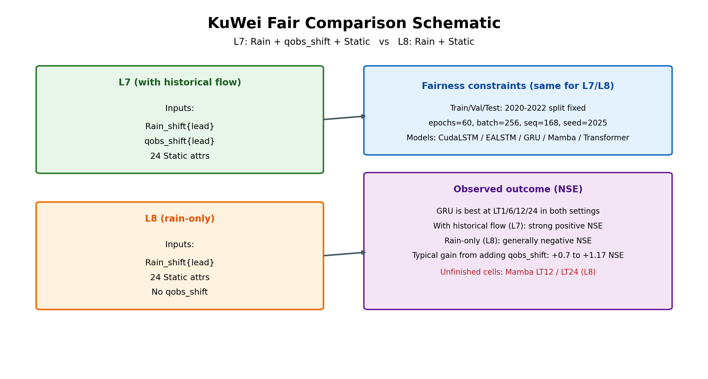
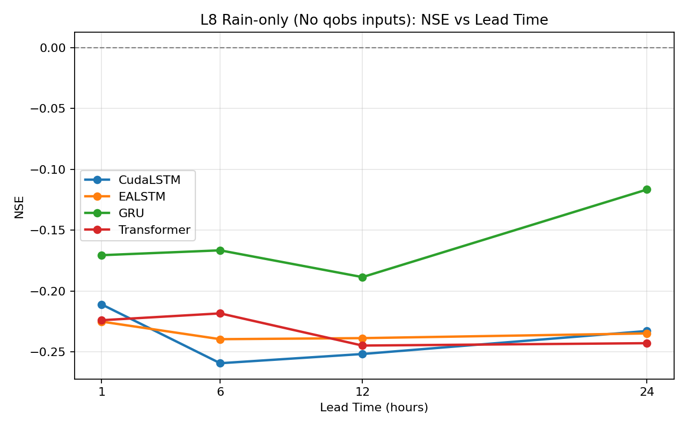
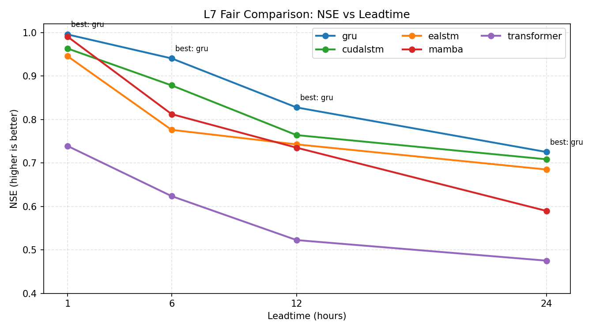
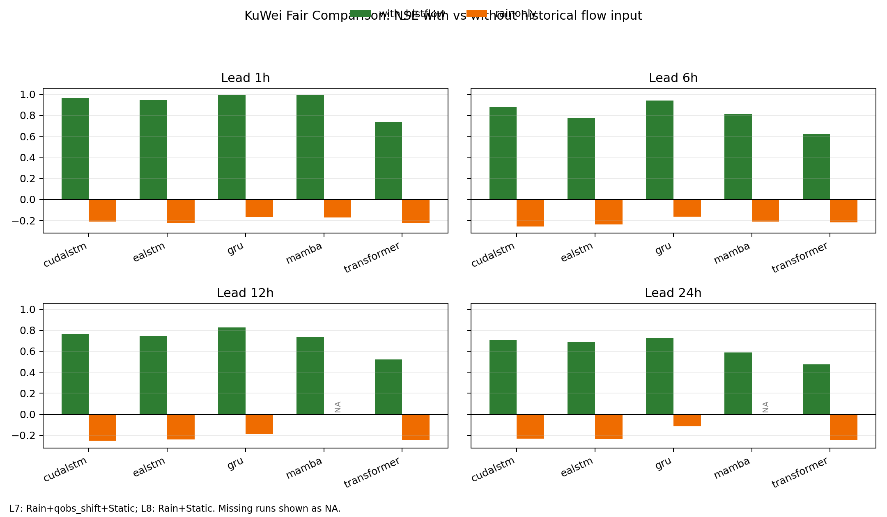
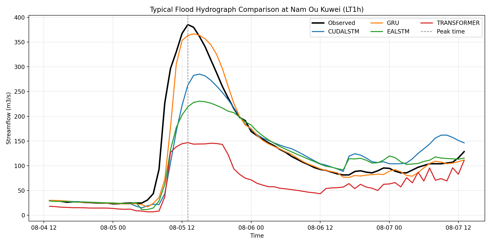

# 不同输入条件下库尾站小时级洪水预报深度学习模型比较及适用性分析

## 摘要

针对库尾站小时级洪水预报中输入方案与模型选型缺乏针对性的问题，以南乌河库尾站为研究对象，选取 CudaLSTM、GRU、EALSTM 和 Transformer 4 种典型深度学习模型，开展不同输入条件和不同预见期下的小时级洪水预报对比试验。基于 2020 年 1 月至 2022 年 12 月的小时尺度雨量与流量资料，分别设置仅降雨输入和降雨结合历史流量输入两类方案，对 1、6、12、24 h 预见期下各模型的预报效果进行系统比较，并采用 NSE、RMSE、KGE 及典型洪水过程线进行评价。结果表明：仅采用降雨输入时，各模型预报效果整体较差，测试期 NSE 多为负值，其中 1 h 预见期下各模型 NSE 为 -0.225 至 -0.171；引入历史流量后，各模型精度显著提高，1 h 预见期下 NSE 提升至 0.739 至 0.996，增幅为 0.963 至 1.174。随着预见期增加，各模型性能总体下降，其中 GRU 和 CudaLSTM 表现较为稳定，综合效果优于其他模型。研究表明，输入条件变化对库尾站小时级洪水预报精度的影响显著大于模型结构差异，历史流量信息是提高模型性能的关键约束因素，递归类模型更适合作为业务预报优选方案。

关键词：库尾站；小时级洪水预报；深度学习；输入条件；历史流量；预见期

## 1 引言

洪水预报是流域防洪调度与风险预警的重要基础工作，预报精度和时效性直接关系到工程调度决策的科学性与防洪减灾效益。与日尺度或较长时间尺度流量预测相比，小时级洪水预报更强调对洪水起涨、峰现时间和洪峰量级的快速响应能力，尤其适用于暴雨洪水过程短、汇流集中、预警时间有限的流域或控制断面[10-14]。库尾站作为连接上游来水过程与库区调度运行的重要控制位置，其流量变化不仅受降雨过程影响，还与前期来水状态、河道传播及局地水动力条件密切相关，因此开展库尾站小时级洪水预报具有较强的工程意义和应用价值[11,14]。

长期以来，洪水预报主要依赖经验统计方法、概念性水文模型及其组合方法。传统统计模型在参数率定和物理解释方面具有一定优势，但对复杂非线性关系和高频时序特征的刻画能力有限；概念性模型虽然能够一定程度反映产汇流机理，但在参数移植、实时修正和局地场景适应性方面仍存在不足。随着高时空分辨率水文气象数据的积累以及计算能力的提升，深度学习方法因具有较强的非线性映射和时序特征提取能力，逐渐成为流量预报和洪水预测研究中的重要技术手段[1-2,17]。近年来，LSTM、EA-LSTM、Transformer 等模型已在降雨径流模拟、流量预测和洪水预报中得到广泛应用，并在多流域、大样本研究中表现出较好的精度和泛化能力[1-2,4-5,18]。

已有研究表明，不同深度学习模型在序列特征提取方式、参数规模及对输入信息的利用能力方面存在差异[1-5]。其中，递归类模型更擅长处理前期状态对当前流量的持续影响，而注意力机制模型在长时依赖关系建模方面具有理论优势[4-5,7]。此外，近实时观测流量信息的引入能够显著改善深度学习流量预测效果，说明输入信息组织方式对模型性能具有重要影响[3,6,15]。然而，现有研究多集中于天然流域出口断面或大样本流域，对库尾站这一具有明显工程控制特征的断面类型，尤其是小时级场景下不同深度学习模型的适用性研究仍相对不足[10-12]。同时，已有模型比较研究往往更多关注精度排序，对不同模型在不同预见期、不同输入条件下的性能变化规律及其工程适用性讨论不够充分[5,16-18]。

基于此，本文以南乌河库尾站为研究对象，选取 CudaLSTM、GRU、EALSTM 和 Transformer 4 种典型深度学习模型，设置仅降雨输入和降雨结合历史流量输入两类方案，对 1、6、12、24 h 预见期下的预报效果进行系统比较，分析不同模型在库尾站场景中的适用性差异及其随预见期变化的规律。本文关注的重点是不同输入条件下模型相对表现及其工程适用性，而非普适意义上的模型优劣排序。在此基础上，进一步讨论历史流量信息对模型精度的影响，并提出适用于库尾站小时级洪水预报的模型选取建议，为类似控制断面的业务预报提供参考[3-4]。

## 2 研究区概况与数据基础

### 2.1 研究区概况

研究区为老挝南乌江（Nam Ou）七级电站库尾站以上控制流域，流域面积约为 1796.46 km²。该区域地形起伏较大，降雨时空分布不均，洪水过程具有突发性强、汇流历时短和峰现时间快等特点。库尾站位于上游来水与库区调度影响相互作用的过渡区域，其流量过程不仅受流域降雨驱动，还受到前期来水状态和河道传播过程影响，因此具有较明显的短时动态变化特征。对于该类断面而言，小时级洪水预报精度直接关系到库区防洪调度和预警响应效果。

研究区内共布设 8 个雨量站，可提供连续小时尺度降雨资料。按照空间位置可分为上游雨量站和下游雨量站两组，其中上游雨量站包括孟乌、班腾、阿卡和库尾，下游雨量站包括班当、半坡寨、小栗树和新寨。库尾站具有连续流量观测资料，可用于构建小时级流量预测样本。总体而言，研究区资料序列较为完整，能够满足深度学习模型训练和检验要求。

### 2.2 数据来源与处理

本文所用数据包括 8 个雨量站小时降雨资料和库尾站小时流量资料。其中，降雨资料来源于研究区内各雨量站实测记录，流量资料来源于库尾站实测流量过程。8 个雨量站在模型中的变量名称分别为 p_aka、p_bandang、p_banpozai、p_banteng、p_kuwei、p_mengwu、p_xiaolishu 和 p_xinzai。选取 2020 年 1 月 1 日至 2022 年 12 月 31 日作为研究时段，时间分辨率统一为 1 h。为保证样本质量，对原始数据进行了完整性检查和时间序列一致性处理，并按照统一标准进行归一化，以提高不同模型训练的稳定性和结果可比性。

### 2.3 样本构建与预见期设置

为开展库尾站小时级洪水预报研究，本文以连续小时序列为基础构建监督学习样本。模型输入包括流域雨量站降雨序列，在部分方案中进一步加入历史流量信息；模型输出为目标预见期对应的库尾站流量。为反映不同业务需求下的预报能力，设置 1 h、6 h、12 h 和 24 h 共 4 个预见期。不同预见期分别构建对应训练样本，并在统一条件下进行模型训练与测试。

根据样本时序分布，将研究资料划分为训练期、验证期和测试期。其中，训练期为 2020-01-01 至 2021-06-30，验证期为 2021-07-01 至 2021-12-31，测试期为 2022-01-01 至 2022-12-31。通过这种按时间顺序划分的方式，可较好反映模型在实际业务应用中的预测性能。

### 2.4 输入方案设置

为比较不同输入信息对模型性能的影响，本文设置两类输入方案。第一类为仅降雨输入方案，即以各雨量站小时降雨序列作为模型输入，用于考察模型对降雨信息的提取能力。第二类为降雨结合历史流量输入方案，即在降雨输入基础上加入前期实测流量信息，用于反映库尾站流量过程的状态依赖特征。通过两类方案对比，可分析历史流量信息在库尾站小时级洪水预报中的作用。

## 3 研究方法

### 3.1 深度学习模型选取

为比较不同类型深度学习模型在库尾站小时级洪水预报中的适用性，本文选取 CudaLSTM、GRU、EALSTM 和 Transformer 作为代表模型。上述模型分别代表了经典递归神经网络、轻量门控递归网络、改进型递归网络和注意力机制两类主要技术路线，能够较好反映当前深度学习在流量预报中的典型建模思路。CudaLSTM 属于长短期记忆网络模型，在流量模拟和洪水预报研究中应用较为广泛[1,8]；GRU 在保留时序记忆能力的同时参数量较少，适合中小样本条件[9]；EALSTM 在传统 LSTM 基础上进一步强化输入信息表达[2]；Transformer 则通过自注意力机制建立序列内部依赖关系，在复杂时间序列建模方面具有一定潜力[4,7]。模型选取兼顾技术代表性与结果完整性，以保证不同模型在统一输入条件和不同预见期下具有良好的可比性。

### 3.2 模型输入与输出设置

结合库尾站小时级洪水预报特点，本文设置两类输入方案。一类为仅降雨输入方案，即以流域雨量站小时降雨序列作为模型输入，用于反映不同模型对降雨信息的提取能力；另一类为降雨结合历史流量输入方案，即在降雨输入基础上加入前期实测流量信息，用于反映库尾站流量演进中的状态依赖特征。已有研究表明，前期观测流量的引入能够显著提高深度学习模型的流量预测能力[3,6,15]，因此本文进一步比较不同模型在上述两类输入条件下的表现差异。模型输出均为目标预见期下的库尾站流量值，预见期设置为 1 h、6 h、12 h 和 24 h。

### 3.3 模型训练与参数设置

为保证不同模型比较的公平性，本文采用统一的数据划分、统一训练样本、统一验证策略和统一评价标准。各模型均以训练集进行参数学习，以验证集进行超参数调整，并在测试集上评价最终效果。模型训练采用统一优化器和统一训练轮次设置，在相同计算环境下完成全部试验。考虑到不同模型对样本规模和参数配置的敏感性差异，模型关键超参数在验证集上进行调整，以使各模型在合理条件下达到较优训练状态[1-2,4-5]。

### 3.4 评价指标与分析方法

为全面评价不同模型的预报效果，本文采用 Nash-Sutcliffe 效率系数（NSE）、均方根误差（RMSE）和 Kling-Gupta 效率系数（KGE）作为主要统计评价指标。其中，NSE 用于衡量模型对流量过程总体拟合程度，RMSE 用于反映预测误差大小，KGE 用于综合评价相关性、变幅和偏差特征[1,3]。除总体指标外，本文还选取测试期内典型洪水过程，比较不同模型对洪峰大小、峰现时间及洪水过程线形态的模拟能力。通过总体指标评价与典型过程分析相结合的方式，可更全面反映不同深度学习模型在库尾站小时级洪水预报中的适用性及工程实用价值[10-12]。

### 3.5 技术路线

本文技术路线如下：首先基于研究区雨量和流量资料构建小时级预报样本；其次分别建立仅降雨输入和降雨结合历史流量输入两类方案；然后在 1 h、6 h、12 h 和 24 h 预见期下，分别训练 CudaLSTM、GRU、EALSTM 和 Transformer 模型；最后基于统计指标和典型洪水过程对不同模型的预报效果进行系统比较，并分析其在库尾站场景下的适用性差异。技术路线见图2。

*图2 库尾站小时级洪水预报研究技术路线*

## 4 不同深度学习模型预报结果比较

### 4.1 仅降雨输入条件下模型预报效果比较

仅采用降雨输入时，不同深度学习模型整体预报效果均较差，其主要评价指标见表3。结果表明，1 h 预见期下 CudaLSTM、EALSTM、GRU 和 Transformer 的测试期 NSE 分别为 -0.211、-0.225、-0.171 和 -0.224；6 h 预见期下对应 NSE 分别为 -0.259、-0.240、-0.167 和 -0.218；12 h 预见期下分别为 -0.252、-0.239、-0.189 和 -0.245；24 h 预见期下分别为 -0.233、-0.235、-0.117 和 -0.243。由此可见，在纯降雨输入条件下，4 种模型均未取得理想预报效果。

从不同预见期下 NSE 的变化趋势可以看出，纯降雨输入条件下模型之间虽存在一定差异，但整体差距不大，且均处于较低水平，如图3(a)所示。其中，GRU 在各预见期下相对略优，但优势有限。例如在 1 h 和 24 h 预见期下，GRU 的 NSE 分别为 -0.171 和 -0.117，高于其他模型，但仍未实现有效预测。说明在库尾站小时级场景中，仅依赖降雨信息难以充分表征流量过程演变，不同模型结构差异尚不足以显著提升整体预报能力。

*图3(a) 仅降雨输入条件下各模型在不同预见期下的NSE变化*

### 4.2 引入历史流量后的模型预报效果比较

在降雨输入基础上引入历史流量后，各模型预报精度均显著提高，其结果见表4。1 h 预见期下，CudaLSTM、EALSTM、GRU 和 Transformer 的 NSE 分别提高至 0.963、0.946、0.996 和 0.739；6 h 预见期下分别为 0.878、0.776、0.940 和 0.624；12 h 预见期下分别为 0.764、0.743、0.828 和 0.522；24 h 预见期下分别为 0.708、0.685、0.725 和 0.475。与表3所示纯降雨输入方案相比，各模型在所有预见期下均表现出明显改善。

进一步比较历史流量引入前后的精度提升幅度可见，不同模型在 1 h 预见期下的 NSE 增幅分别为 1.174、1.171、1.166 和 0.963，在 6 h 预见期下分别为 1.138、1.016、1.107 和 0.842，具体见图4。结果表明，历史流量信息对不同模型均具有显著增益作用，是提高库尾站小时级洪水预报精度的重要约束信息。尤其在短预见期条件下，历史流量的引入使各模型由“总体无效”转变为“具有较高精度”的预报工具，说明库尾站流量过程具有明显的状态依赖特征。

*图3(b) 引入历史流量后各模型在不同预见期下的NSE变化*

*图4 引入历史流量前后各模型NSE提升幅度比较*

### 4.3 不同预见期下模型性能变化特征

结合图3(b)可以看出，在引入历史流量后，各模型均表现出“短预见期精度高、长预见期精度下降”的规律。以 GRU 为例，其 NSE 由 1 h 的 0.996 逐步下降至 6 h 的 0.940、12 h 的 0.828 和 24 h 的 0.725；CudaLSTM 则由 0.963 依次降至 0.878、0.764 和 0.708；EALSTM 和 Transformer 也表现出相似趋势。说明随着预见期增加，未来流量受降雨过程、传播滞后及不确定性累积影响逐渐增强，模型预测难度不断加大。

从模型相对表现看，GRU 在 1 h 至 24 h 各预见期下均保持较优或最优结果，表现出较好的稳定性；CudaLSTM 在各预见期下均紧随其后，且与 GRU 差距不大；EALSTM 整体略低于前两者，但仍保持正 NSE；Transformer 在各预见期下均明显低于递归类模型。由此表明，在当前单站点、小时级、中小样本条件下，递归类模型在时序状态表征方面更适合库尾站洪水预报任务。

### 4.4 典型洪水过程分析

为进一步分析不同模型对洪水过程的刻画能力，选取测试期内一次典型洪水过程进行对比，结果如图5所示。该过程起止时间为 2022 年 8 月 4 日 13 时至 2022 年 8 月 7 日 13 时，实测洪峰出现在 2022 年 8 月 5 日 13 时，峰值流量约为 385.33 m³/s。图5表明，4 种模型均能较好反映洪水起涨和退水的总体趋势，但对洪峰幅值和峰现附近过程的刻画能力存在明显差异。

从典型洪水过程比较结果看，GRU 对洪峰段的拟合效果最好，在峰值时刻的模拟流量为 363.23 m³/s，与实测值最为接近；CudaLSTM 对整体过程变化趋势能够较好跟踪，但对洪峰有一定低估，峰值时刻模拟流量为 262.79 m³/s；EALSTM 对涨水段和退水段具有一定刻画能力，但对洪峰幅值低估较明显，峰值时刻模拟流量为 219.00 m³/s；Transformer 对洪峰响应最弱，峰值时刻仅模拟为 146.70 m³/s，且在退水段整体偏低。由此可见，递归类模型在典型洪水事件中的过程线拟合能力和稳定性整体优于注意力类模型。

进一步分析发现，在典型洪水过程中，各模型在退水段的模拟差异明显小于洪峰段，说明不同模型对缓变流量过程的刻画能力相对接近，而对快速起涨和洪峰附近的高频变化响应存在更明显差异。对于库尾站小时级业务预报而言，洪峰附近过程的准确刻画具有更高工程价值，因此 GRU 和 CudaLSTM 在典型事件中的表现进一步验证了其作为优选业务模型的合理性。

*图5 典型洪水过程下不同模型预报结果对比*

### 4.5 小结

综合表3、表4及图3至图5可知，不同输入条件下，输入信息变化对库尾站小时级洪水预报精度的影响明显大于模型结构差异。仅采用降雨输入时，4 种模型测试期 NSE 均为负值；引入历史流量后，各模型精度显著提高，在 1 h 预见期下提升幅度达到 0.963 至 1.174。在模型比较方面，GRU 和 CudaLSTM 在不同预见期下表现最为稳定，EALSTM 次之，Transformer 整体较弱。结果表明，合理利用前期流量信息比单纯提高模型复杂度更为重要。

## 5 讨论

本文结果表明，不同输入条件下库尾站小时级洪水预报的关键不在于采用何种最复杂的深度学习结构，而在于模型能否有效利用前期状态信息。总体而言，输入信息变化对预报精度的影响大于模型结构差异，历史流量信息是库尾站小时级洪水预报中的关键约束条件。在纯降雨输入条件下，4 种模型在不同预见期下的 NSE 均为负值，说明单一降雨信息难以支撑高精度流量预测。结合库尾站工程特征可以认为，库尾站流量过程除受降雨驱动外，还明显受前期来水状态、河道传播及系统记忆效应影响，因此缺少历史流量约束时，模型很难准确反映短时流量演变。

在引入历史流量后，所有模型预报精度均显著提升，且提升幅度明显大于模型之间的结构差异。例如在 1 h 预见期下，Transformer 的 NSE 由 -0.224 提升至 0.739，GRU 则由 -0.171 提高至 0.996。这说明本文的比较重点应放在不同模型在不同输入条件下的适用性差异，而非脱离输入条件的绝对结构优劣排序。换言之，历史流量信息是库尾站小时级洪水预报中的主导信息源，而模型结构更多影响的是该信息的利用效率和结果稳定性。

从模型类型看，递归类模型表现优于注意力类模型，说明在单站点、小样本、小时级时序任务中，结构较简洁、针对短时连续依赖关系建模更直接的模型仍具有优势。GRU 在 1 h 至 24 h 各预见期下均保持较优表现，反映出其在参数规模、训练稳定性和时序特征提取方面具有较好平衡；CudaLSTM 同样表现稳定；Transformer 虽具备更强的长时依赖建模能力，但在当前样本条件下未显示出明显优势，说明模型复杂度增加并不必然带来预报收益。

对于业务应用而言，模型选型不能仅依据单项指标最优结果，而应综合考虑不同预见期下的稳定性、对输入信息变化的敏感性以及部署成本。从本研究结果看，GRU 和 CudaLSTM 更适合作为当前库尾站小时级业务预报模型的优选方案。与此同时，前期流量信息对预报效果的决定性作用提示后续研究可进一步围绕观测流量更新、多源信息融合及状态修正机制开展探索，以提升模型在更长预见期和更复杂情景下的适用性。

需要指出的是，本文基于单一库尾站开展模型比较，结论主要反映该站点场景下不同模型的相对表现规律。不同流域面积、降雨空间分布及水动力条件下，模型适用性可能存在差异。此外，本文主要比较了现有输入条件下的多模型预报性能，尚未进一步讨论降雨空间信息补充、产品数据引入及模型集成等问题，相关内容仍有待后续研究。

## 6 结论

1. CudaLSTM、GRU、EALSTM 和 Transformer 均可用于库尾站小时级洪水预报，但模型性能总体随预见期增加而下降。  
2. 在仅采用降雨输入条件下，4 种模型测试期 NSE 均为负值，说明单一降雨信息难以有效刻画库尾站小时级流量变化过程。  
3. 在降雨输入基础上引入历史流量后，各模型预报精度均显著提高，表明前期流量信息是提升库尾站小时级洪水预报精度的重要约束条件。  
4. 在本研究条件下，递归类模型整体表现较为稳定，其中 GRU 和 CudaLSTM 的综合效果优于 EALSTM 和 Transformer，更适合作为库尾站小时级洪水业务预报的优选模型。  
5. 对库尾站小时级洪水预报而言，模型选型应兼顾精度、稳定性与业务可实施性，重视输入信息组织与模型时序建模能力的匹配关系；在当前研究条件下，宜优先选用训练稳定、对前期状态信息利用充分的递归类模型。  

## 参考文献

[1] KRATZERT F, KLOTZ D, BRENNER C, et al. Rainfall-runoff modelling using Long Short-Term Memory (LSTM) networks[J]. Hydrology and Earth System Sciences, 2018, 22: 6005-6022.  
[2] KRATZERT F, KLOTZ D, SHALEV G, et al. Towards learning universal, regional, and local hydrological behaviors via machine learning applied to large-sample datasets[J]. Hydrology and Earth System Sciences, 2019, 23(12): 5089-5110.  
[3] NEARING G S, KRATZERT F, SAMPSON A K, et al. Technical note: Data assimilation and autoregression for using near-real-time streamflow observations in long short-term memory networks[J]. Hydrology and Earth System Sciences, 2022, 26: 5493-5513.  
[4] YIN J, DENG Z, INES A V M, et al. RR-Former: Rainfall-runoff modeling based on Transformer[J]. Journal of Hydrology, 2022, 615: 128681.  
[5] KOYA S, ROY T. Temporal Fusion Transformers for streamflow prediction: Value of combining attention with recurrence[J]. Journal of Hydrology, 2024, 638: 131658.  
[6] YANG Y, HSU K, YANG T, et al. Improving streamflow simulation through machine learning-powered data integration and its potential for forecasting in the Western U.S.[J]. Hydrology and Earth System Sciences, 2025, 29: 5453-5478.  
[7] VASWANI A, SHAZEER N, PARMAR N, et al. Attention is all you need[C]//Advances in Neural Information Processing Systems. Red Hook: Curran Associates, 2017: 5998-6008.  
[8] HOCHREITER S, SCHMIDHUBER J. Long short-term memory[J]. Neural Computation, 1997, 9(8): 1735-1780.  
[9] CHO K, VAN MERRIËNBOER B, GULCEHRE C, et al. Learning phrase representations using RNN encoder-decoder for statistical machine translation[EB/OL]. arXiv:1406.1078, 2014[2026-03-24]. https://arxiv.org/abs/1406.1078.  
[10] 刘万, 谢帅, 钟德钰, 等. 基于深度学习与HEC-HMS模型的小流域暴雨洪水耦合预报[J]. 水利学报, 2025, 56(3): 364-374.  
[11] 李承龙, 郭生练, 梁志明, 等. 基于深度学习的长江-洞庭湖流域洪水模拟预报研究[J]. 水利学报, 2025, 56(6): 717-725.  
[12] 许月萍, 周欣磊, 王若桐, 等. 基于集成学习与深度学习的洪水径流预报研究[J]. 人民长江, 2024, 55(9): 18-25. DOI:10.16232/j.cnki.1001-4179.2024.09.003.  
[13] 赵玲玲, 刘昌明, 王梓尹, 等. 中小流域暴雨洪水计算及参数地理综合研究进展[J]. 热带地理, 2023, 43(11): 2119-2134. DOI:10.13284/j.cnki.rddl.003763.  
[14] 刘攀, 叶浩, 张晓菁, 等. 特约论文:预报引导的水库调度综述[J/OL]. 水力发电学报, 2025, 44(8). DOI:10.11660/slfdxb.20250801.  
[15] FENG D, FANG K, SHEN C. Enhancing streamflow forecast and extracting insights using long-short term memory networks with data integration at continental scales[J]. Water Resources Research, 2020, 56(9): e2020WR028390.  
[16] DE LA FUENTE L A, EHSANI M R, GUPTA H V, et al. Toward interpretable LSTM-based modeling of hydrological systems[J]. Hydrology and Earth System Sciences, 2024, 28: 945-971.  
[17] NG C H J, TURNER S W D, GALELLI S. A review of hybrid deep learning applications for streamflow forecasting[J]. Journal of Hydrology, 2023, 626: 130318.  
[18] YIN H, ZHU W, ZHANG X, et al. Runoff predictions in new-gauged basins using two transformer-based models[J]. Journal of Hydrology, 2023, 622: 129684. DOI:10.1016/j.jhydrol.2023.129684.  
